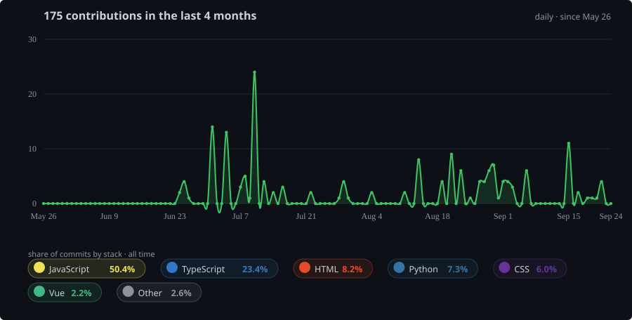

<!-- ========================================================= -->
<!-- HEADER -->
<!-- ========================================================= -->

# Hi, I'm Harsh Shah 👋

### Full-Stack Software Engineer
**Next.js · React · NestJS · Python · .NET · AI/LLM**

  
  
  

  

---

## 👨‍💻 About Me

I'm a **Full-Stack Software Engineer** focused on building and deploying
production web applications, backend services, enterprise platforms,
and AI-powered automation systems.

Currently working as a **Software Developer I at NemX Infotech**, where I
work across:

- **Next.js / React**
- **NestJS / Node.js**
- **Python**
- **.NET APIs**
- **PostgreSQL**
- **LangChain / LangGraph**
- **REST APIs & third-party integrations**
- **CI/CD & production deployments**

I also have experience working directly with clients through freelance
projects, taking applications from **requirements → development → deployment**.

---

## ⚡ Engineering Highlights

| | |
|---|---|
| 🚀 **70+** | Production applications delivered |
| 👥 **50+** | Clients served |
| 🔌 **25+** | Production APIs built |
| ⚡ **83%** | Dashboard execution-time reduction |
| 🧠 **62%** | Backend memory reduction |
| 💾 **1M+** | Financial records processed daily |
| 🤖 **27** | Third-party APIs integrated into AI workflows |
| 🏦 **100+** | Banking entities supported |

---

## 🛠️ Tech Stack

### Frontend

  
  
  
  

### Backend

  
  
  
  
  

### Databases

  
  
  

### AI / LLM

  
  
  

### DevOps & Tools

  
  
  
  
  

---

## 🚀 Featured Work

### 🤖 AI Lead Generation & Automation Platform

AI-powered lead qualification and automation platform.

**Stack:** `OpenAI` `LangChain` `Node.js` `MongoDB`

- Automated **70% of manual lead qualification**
- Integrated **27 third-party APIs**
- Designed backend services for **1M+ lead records**
- Built centralized API orchestration for AI-powered workflows

---

### 🏢 Enterprise CRM & Order Management

Large-scale CRM and order management platform.

**Stack:** `Next.js` `Express.js` `PostgreSQL`

- **34 functional modules**
- Inventory management
- Subscription management
- Invoicing
- WhatsApp receipt generation
- **78K+ LOC production application**
- Scalable PostgreSQL schemas and REST APIs

---

### 💬 Full-Stack Applications

I've built and deployed **70+ production applications** for clients,
including dashboards, business applications, automation platforms,
and static websites.

---

---

## 📊 GitHub Stats

---

## 🔥 Contribution Streak

---

## 📈 Contribution Activity

---

<b>🎯 What I'm currently interested in</b>

 

- Building production-grade **AI applications**
- LLM orchestration with **LangChain and LangGraph**
- Full-stack SaaS architecture
- High-performance PostgreSQL systems
- Backend architecture and API design
- AI agents and workflow automation
- Remote engineering opportunities

<b>💼 Open to opportunities</b>

 

I'm currently open to:

- 🌎 Remote Full-Time Software Engineering roles
- 🤝 Remote Contract opportunities
- 🚀 Full-Stack Engineering
- 🤖 AI / LLM Application Engineering
- 🏗️ Backend Engineering

**Availability:** Immediate

---

## 🤝 Let's Connect

 

### Thanks for visiting 👋

